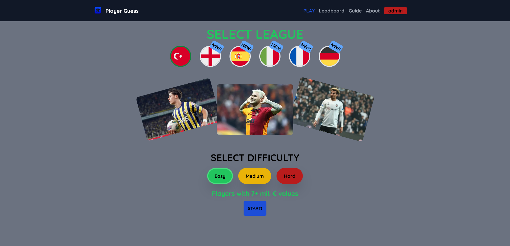
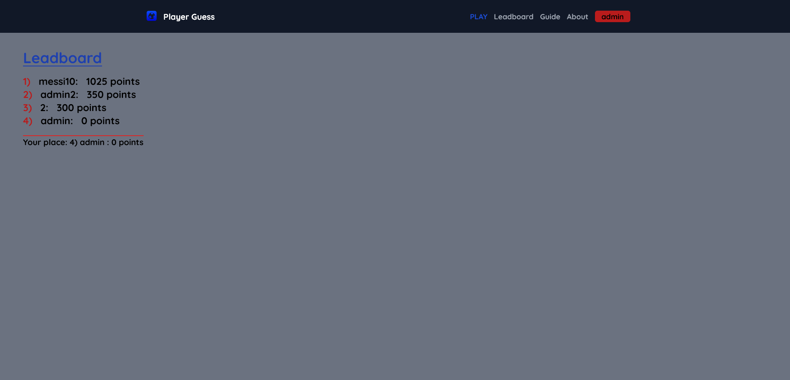
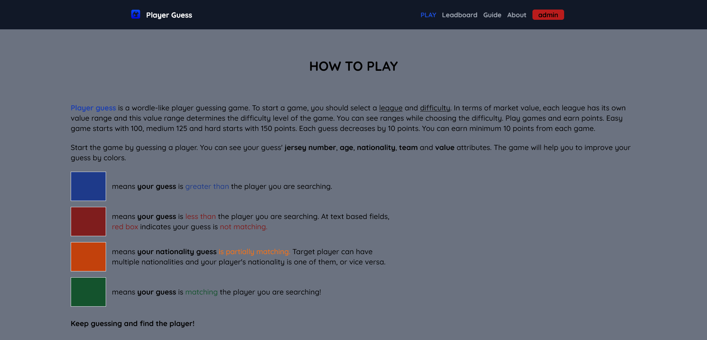
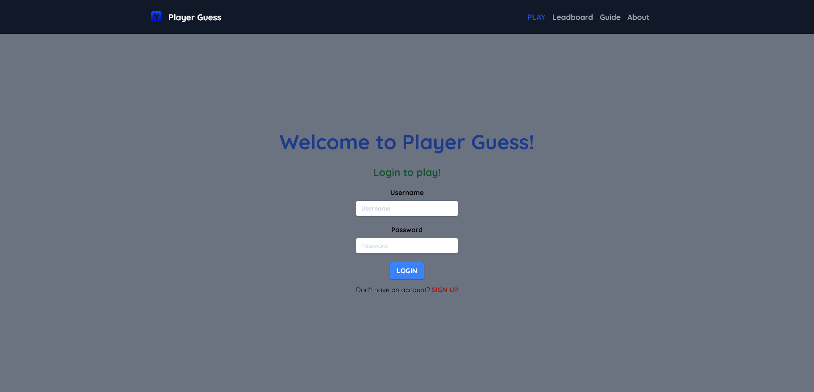

# Player Guess Game

Live website:

# Overview

Made by:

- **Next.js**
- TypeScript
- Tailwind CSS
- MongoDB

## Description

- This is a "wordle"-like player guessing game.
- API data collected from me.
- Guess among 2000 football players from 5 big league and Turkish Super League.
- You can log in and save your points. You can see leadboard among all users.
- This project deployed to Cyclic App.

### Author

- LinkedIn - [Ömer Fatih Bülbül](https://www.linkedin.com/in/ömer-fatih-bülbül-74a890236/)
- Twitter - [fatihbulbul91](https://twitter.com/fatihbulbul91)
